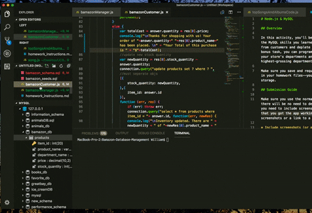
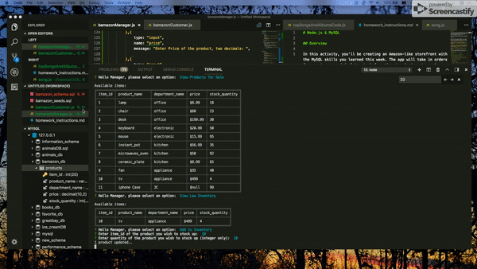

# Bamazon-Database-Management
    Bamazon is an Amazon-like storefront with the MySQL skills. The app will take in orders from customers and deplete stock from the store's inventory.

## Motivation
    The bamazon app is a project for practicing node.js and mySQL in a really word senario. The combination of these two tools can be powerfull and meaningfull in future career development. 

## Dependencies
    The app uses inquirer and my sql npm. Therefore, once you clone the file from the github, start runing the app by entering folowing command in terminal: 
        npm i
    This should install all dependencies used for this app.

## How to use

* create database called **bamazon_db** in you *sequel* Pro or *mySQLworkbench*; 

* run bamazon_schema.sql and then bamazon_seeds.sql

Customer Interface: 
* in terminal, use _command:_ "node bamazonCustomer.js" to run the customer interface. 

    - Running this application will first display all of the items available for sale. Include the ids, names, and prices of products for sale.

    - The app would then prompt you with two messages.
        * The first should ask for the ID of the product you would like to buy.
        * The second message asks how many units of the product you would like to buy.

    - Once the customer has placed the order, the application would     check if the store has enough of the product to meet the          your request.

   * If not, the app would log a phrase like `Insufficient             quantity!`, and then prevent the order from going through.

    
 
 Manager Interface: 
* in terminal, use _command:_ "node bamazonManager.js" to run the manager interface.
    
    - Running this application will:

        * List a set of menu options:

            * View Products for Sale
            
            * View Low Inventory
            
            * Add to Inventory
            
            * Add New Product

    * If a manager selects `View Products for Sale`, the app should list every available item: the item IDs, names, prices, and quantities.

    * If a manager selects `View Low Inventory`, then it should list all items with an inventory count lower than five.

    * If a manager selects `Add to Inventory`, your app should display a prompt that will let the manager "add more" of any item currently in the store.

    * If a manager selects `Add New Product`, it should allow the manager to add a completely new product to the store.

    

## DEVELOPER
    Chunjin (William) Gao 
    email: seewilliam.gao@gmail.com
    please feel free to offer him a job or if you have any question.

Thanks for visting this app!